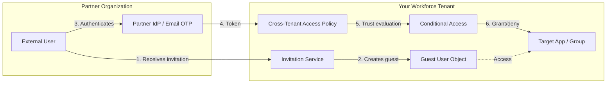
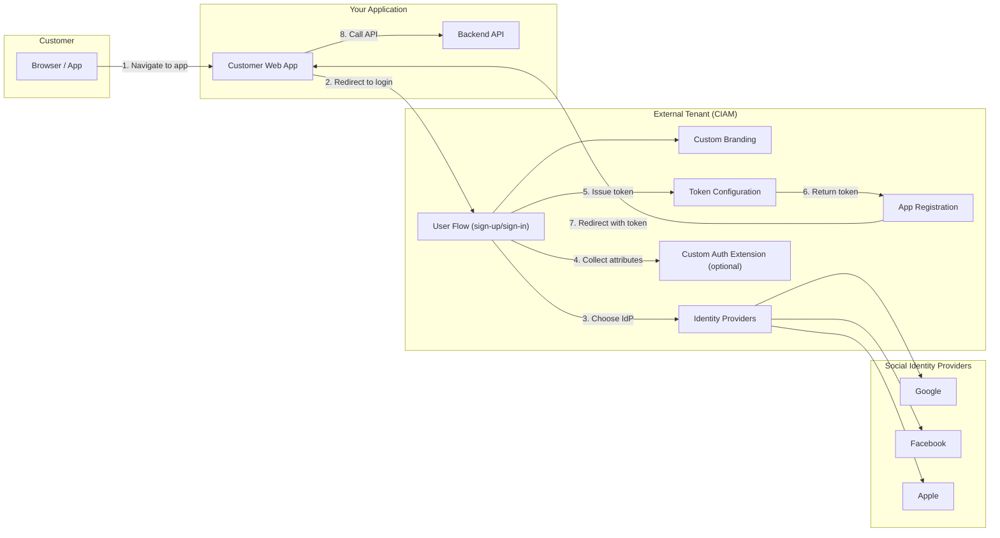

```mermaid
flowchart LR
    subgraph TenantA["Your Tenant (Resource)"]
        CTAA["Cross-Tenant Access Policy"]
        Team["Teams Team"]
        SharedCh["Shared Channel"]
    end

    subgraph TenantB["Partner Tenant (Home)"]
        CTAB["Cross-Tenant Access Policy"]
        PartnerUser["Partner User"]
        PartnerAuth["Partner Authentication"]
    end

    PartnerUser -->|"1. Authenticates at home"| PartnerAuth
    PartnerAuth -->|"2. Home tenant token"| CTAB
    CTAB -->|"3. Outbound direct connect allowed"| CTAA
    CTAA -->|"4. Inbound direct connect allowed"| SharedCh
    SharedCh -.->|"Access granted"| Team
```

# External Identities Scenarios

## Choosing Your External Identity Model

Before configuring External Identities, determine which model fits the administrator's use case. Use the following discovery questions to guide the selection:

### Initial POC Discovery Questions

| # | Question | Guidance |
|---|---|---|
| 1 | **Who are the external users?** | Partners, vendors, contractors → **B2B Collaboration**. Customers, consumers, citizens → **CIAM**. Users in a partner Entra ID org who need Teams shared channels → **B2B Direct Connect**. |
| 2 | **What authentication methods do external users need?** | Email OTP + Microsoft account → B2B Collaboration (default). Social IdPs (Google, Facebook, Apple) → CIAM. SAML/WS-Fed federation with partner's IdP → B2B Collaboration with federation. Passkeys/FIDO2 → supported in all models via home tenant. |
| 3 | **Do you need Teams shared channels with another organization?** | Yes → **B2B Direct Connect** (mutual trust, no guest provisioning). No → B2B Collaboration or CIAM depending on user type. |
| 4 | **What level of branding/customization is required?** | Default Microsoft sign-in experience is acceptable → B2B Collaboration. Fully branded login pages with custom domain, logo, CSS, layout → CIAM (external tenant). |
| 5 | **What are the compliance requirements for external users?** | MFA required for guests → Conditional Access + cross-tenant MFA trust (B2B). Access reviews for guest lifecycle → B2B + ID Governance. Self-service password reset, progressive profiling → CIAM. |
| 6 | **What is the existing infrastructure?** | Existing Entra ID workforce tenant → B2B Collaboration (guests in same tenant). Need a separate tenant for customer scenarios → CIAM (external tenant). Partner already has Entra ID → B2B Direct Connect possible. |

### Model Comparison

| Criteria | B2B Collaboration | B2B Direct Connect | CIAM (External ID for Customers) |
|---|---|---|---|
| **User type** | Partners, vendors, contractors | Partner org users (Entra ID) | Consumers, customers, citizens |
| **User object** | Guest account in workforce tenant | No guest object provisioned | User in external tenant |
| **Authentication** | Home tenant, email OTP, Microsoft account, Google, SAML/WS-Fed | Home tenant only (mutual trust) | Social IdPs, email + password, email OTP, passkeys |
| **Branding** | Standard Microsoft sign-in | Partner's home tenant sign-in | Fully customizable (custom domain, CSS, logo, layout) |
| **Governance** | Access reviews, entitlement management, lifecycle workflows | Cross-tenant access policies | User flows, self-service sign-up, progressive profiling |
| **Conditional Access** | CA policies target guest users | Trusts partner CA evaluation | CA in external tenant |
| **Licensing** | Free tier (50K MAU) + P1/P2 for CA & governance | Included with base Entra ID | Consumption-based (50K MAU free) |
| **Typical POC time** | 45 min | 30 min | 60 min |

### Technical Prerequisites (All Models)

| Requirement | B2B Collaboration | B2B Direct Connect | CIAM |
|---|---|---|---|
| **Minimum license** | Entra ID Free (P1 for CA) | Entra ID Free (both tenants) | Entra External ID or Entra Suite |
| **Admin roles** | Global Admin or Security Admin + Guest Inviter | Global Admin or Security Admin (both tenants) | Global Admin (for external tenant creation) |
| **Partner cooperation** | No (one-sided invite) | Yes (mutual cross-tenant config) | No (your tenant only) |
| **DNS/domain** | Optional (for federation) | No | Recommended (custom domain for branding) |
| **Test users** | External email accounts for guest testing | Users in partner Entra ID tenant | Consumer email or social accounts |
| **Apps/resources** | Apps or groups to grant guest access | Teams with shared channels enabled | Customer-facing app (SPA, web, or native) |

### Required Entra Admin Roles

| Role | Scope | B2B Collaboration | B2B Direct Connect | CIAM |
|---|---|---|---|---|
| **Global Administrator** | Full control over all external identity features, tenant creation | ✅ | ✅ (both tenants) | ✅ (required for external tenant creation) |
| **Security Administrator** | Cross-tenant access policies, Conditional Access for guests | ✅ | ✅ (both tenants) | ✅ |
| **External Identity Provider Administrator** | Manage social IdPs (Google, Facebook, Apple) and SAML/WS-Fed federation | ✅ | ❌ | ✅ |
| **External ID User Flow Administrator** | Create and manage user flows, attribute collection, and custom extensions | ❌ | ❌ | ✅ |
| **Guest Inviter** | Invite external users as guests (B2B collaboration) | ✅ | ❌ | ❌ |
| **Application Administrator** | Register and configure apps (external tenant or workforce tenant) | Optional | ❌ | ✅ |
| **Conditional Access Administrator** | Create and manage CA policies targeting guests or external users | ✅ | ✅ | ✅ |
| **Global Reader** | Read-only access for validation, gap analysis, and audit | ✅ | ✅ | ✅ |

> [!TIP]
> For POC deployments, **Global Administrator** is the simplest approach. For production, follow least-privilege: combine **Security Administrator** + **Guest Inviter** for B2B Collaboration, or **External ID User Flow Administrator** + **External Identity Provider Administrator** for CIAM.

### Tools Available

| Tool | Purpose | Applicable Models |
|---|---|---|
| **Entra Admin Center** | Primary portal for all External ID configuration (cross-tenant access, identity providers, user flows, branding) | All |
| **Azure Portal** | External tenant creation, subscription management | CIAM |
| **Microsoft Graph Explorer** | Interactive API testing for cross-tenant policies, invitations, user flows | All |
| **Teams Admin Center** | Shared channel policies and external collaboration settings | B2B Direct Connect |
| **PowerShell — Microsoft.Graph module** | Automated configuration via `Invoke-MgGraphRequest`, bulk invitation, policy deployment | All |
| **Azure CLI (`az rest`)** | REST-based scripting alternative for Graph API calls | All |
| **jwt.ms** | Decode and inspect tokens issued by external tenant (verify claims) | CIAM |
| **Fiddler / Browser DevTools** | Trace authentication flows, inspect redirect URIs and token responses | All |
| **Postman** | API collection for Graph API testing with pre-built External ID requests | All |

### SDKs Available

| SDK | Language | Key Packages / Modules | Use Case |
|---|---|---|---|
| **Microsoft Graph SDK** | .NET (C#) | `Microsoft.Graph` (NuGet) | Automate invitations, cross-tenant policies, user flow management |
| **Microsoft Graph SDK** | Python | `msgraph-sdk` (PyPI) | Scripted bulk guest invitation, policy reads, gap analysis automation |
| **Microsoft Graph SDK** | JavaScript/TypeScript | `@microsoft/microsoft-graph-client` (npm) | Node.js automation, Azure Functions for custom auth extensions |
| **Microsoft Graph SDK** | Java | `microsoft-graph` (Maven) | Enterprise Java apps integrating with External ID |
| **Microsoft Graph SDK** | Go | `github.com/microsoftgraph/msgraph-sdk-go` | Go-based tooling and automation |
| **MSAL (Microsoft Authentication Library)** | .NET, Python, JS, Java, Go | `Microsoft.Identity.Client`, `msal`, `@azure/msal-browser`, `msal4j` | Acquire tokens for Graph API calls, implement OIDC in customer apps |
| **Microsoft Identity Web** | .NET | `Microsoft.Identity.Web` (NuGet) | ASP.NET Core integration with external tenant (CIAM app development) |
| **Azure Identity** | .NET, Python, JS, Java | `Azure.Identity`, `azure-identity`, `@azure/identity` | Credential management for service-to-service calls |
| **Microsoft.Graph.PowerShell** | PowerShell | `Microsoft.Graph` (PowerShell Gallery) | Admin scripting for cross-tenant policies, bulk operations, automation |

> [!NOTE]
> For CIAM customer-facing apps, use **MSAL** to implement authentication flows (authorization code + PKCE for SPAs, confidential client for web apps). For admin automation and policy management, use the **Microsoft Graph SDK** in your preferred language.

### Service Limits and Scalability

| Limit | Value | Applicable Model | Notes |
|---|---|---|---|
| **Guest users per tenant** | 50,000 (free tier MAU) | B2B Collaboration | Beyond 50K MAU requires P1/P2 license; no hard cap on guest objects |
| **Bulk invitation batch size** | 500 invitations per request | B2B Collaboration | Use `POST /invitations` in batches; Graph API batch limit is 20 requests per JSON batch |
| **Cross-tenant access partner configurations** | 25 per tenant (default) | B2B Collab / Direct Connect | Can be increased via support request; each partner org = 1 configuration |
| **Identity providers per tenant** | 300 | All | Includes social IdPs, SAML/WS-Fed federations |
| **CIAM Monthly Active Users (MAU)** | 50,000 free tier | CIAM | Beyond 50K MAU: consumption-based pricing per authentication |
| **User flows per external tenant** | 50 | CIAM | Each flow can serve multiple apps |
| **Custom authentication extensions per tenant** | 100 | CIAM | API connectors for validation/enrichment |
| **App registrations per tenant** | 300,000 | All | Practical limit; rarely reached in POC |
| **Conditional Access policies per tenant** | 195 | All | Shared across all CA policies (not just guest policies) |
| **Graph API throttling** | 10,000 requests per 10 min per app | All | Per-app limit; use `$batch` and retry with `Retry-After` header |
| **Invitation redemption expiry** | 90 days (configurable) | B2B Collaboration | Unredeemed invitations expire; resend or extend via policy |
| **Token lifetime (default)** | 1 hour (access), 24 hours (refresh) | All | Configurable via token lifetime policies |
| **Shared channels per team** | 30 | B2B Direct Connect | Teams platform limit |
| **External participants per shared channel** | 50 | B2B Direct Connect | Teams platform limit for external members |

> [!IMPORTANT]
> These limits reflect current service defaults and may change. Always verify against the latest Microsoft documentation before production planning.

**Reference documentation:**
- [Microsoft Entra service limits and restrictions](https://learn.microsoft.com/en-us/entra/identity/users/directory-service-limits-restrictions)
- [Microsoft Entra External ID pricing (MAU-based)](https://learn.microsoft.com/en-us/entra/external-id/external-identities-pricing)
- [Microsoft Graph throttling guidance](https://learn.microsoft.com/en-us/graph/throttling)
- [Cross-tenant access settings limits](https://learn.microsoft.com/en-us/entra/external-id/cross-tenant-access-overview)
- [Teams limits for shared channels](https://learn.microsoft.com/en-us/microsoftteams/limits-specifications-teams#channels)

---

## Scenario: external-id-b2b-collab

**Name:** B2B Collaboration — Guest User Onboarding
**Description:** Configure cross-tenant access policies and invitation settings to securely onboard external partner users as guests. Includes identity provider configuration (email OTP, Google federation), Conditional Access policies for guests requiring MFA, and cross-tenant trust settings to accept partner MFA claims. Demonstrates the full guest lifecycle from invitation through redemption to access.
**Products:** Microsoft Entra External ID, Conditional Access
**Complexity:** Medium
**Estimated Time:** 45 minutes

### Prerequisites

- **Licenses:** Microsoft Entra ID P1 or higher (for Conditional Access for guests); Entra ID Free for basic invitations
- **Roles:** Global Administrator OR (Security Administrator + Guest Inviter)
- **Infrastructure:**
  - External email accounts for testing guest invitations (e.g., Gmail, partner corporate email)
  - Target app or Microsoft 365 group to grant guest access
  - Partner tenant ID (if configuring per-partner cross-tenant access)

### Architecture



### Configuration Steps

1. **Configure cross-tenant access default settings**
   - Component: Cross-Tenant Access Policy
   - Portal Path: **Entra admin center** > **External Identities** > **Cross-tenant access settings** > **Default settings**
   - Graph API: GET /policies/crossTenantAccessPolicy/default
   - Body (update inbound trust):
     ```json
     {
       "inboundTrust": {
         "isMfaAccepted": true,
         "isCompliantDeviceAccepted": false,
         "isHybridAzureADJoinedDeviceAccepted": false
       }
     }
     ```
   - Graph API: PATCH /policies/crossTenantAccessPolicy/default
   - Validation: GET /policies/crossTenantAccessPolicy/default -> `"isMfaAccepted": true`

2. **Add partner organization (per-partner configuration)**
   - Component: Cross-Tenant Access Policy
   - Portal Path: **External Identities** > **Cross-tenant access settings** > **Organizational settings** > **Add organization**
   - Graph API: POST /policies/crossTenantAccessPolicy/partners
   - Body:
     ```json
     {
       "tenantId": "{partner-tenant-id}",
       "inboundTrust": {
         "isMfaAccepted": true,
         "isCompliantDeviceAccepted": true,
         "isHybridAzureADJoinedDeviceAccepted": false
       },
       "b2bCollaborationInbound": {
         "usersAndGroups": {
           "accessType": "allowed",
           "targets": [{"target": "AllUsers", "targetType": "user"}]
         },
         "applications": {
           "accessType": "allowed",
           "targets": [{"target": "AllApplications", "targetType": "application"}]
         }
       }
     }
     ```
   - Validation: GET /policies/crossTenantAccessPolicy/partners -> partner entry exists

3. **Enable email one-time passcode for guests**
   - Component: Authentication Methods
   - Portal Path: **Entra admin center** > **Protection** > **Authentication methods** > **Email OTP**
   - Graph API: PATCH /policies/authenticationMethodsPolicy/authenticationMethodConfigurations/email
   - Body:
     ```json
     {
       "@odata.type": "#microsoft.graph.emailAuthenticationMethodConfiguration",
       "state": "enabled",
       "allowExternalIdToUseEmailOtp": "enabled"
     }
     ```
   - Validation: GET /policies/authenticationMethodsPolicy/authenticationMethodConfigurations/email -> `"state": "enabled"`

4. **Configure Google federation (optional)**
   - Component: Identity Providers
   - Portal Path: **External Identities** > **All identity providers** > **Google**
   - Graph API: POST /identityProviders
   - Body:
     ```json
     {
       "@odata.type": "microsoft.graph.socialIdentityProvider",
       "displayName": "Google",
       "identityProviderType": "Google",
       "clientId": "{google-oauth-client-id}",
       "clientSecret": "{google-oauth-client-secret}"
     }
     ```
   - Validation: GET /identityProviders -> Google provider listed

5. **Configure external collaboration settings (who can invite)**
   - Component: Authorization Policy
   - Portal Path: **External Identities** > **External collaboration settings**
   - Graph API: PATCH /policies/authorizationPolicy
   - Body:
     ```json
     {
       "allowInvitesFrom": "adminsAndGuestInviters",
       "allowedToSignUpEmailBasedSubscriptions": true
     }
     ```
   - Validation: GET /policies/authorizationPolicy -> `"allowInvitesFrom": "adminsAndGuestInviters"`

6. **Send test invitation**
   - Component: Invitations
   - Portal Path: **Entra admin center** > **Users** > **Invite external user**
   - Graph API: POST /invitations
   - Body:
     ```json
     {
       "invitedUserEmailAddress": "{external-user-email}",
       "inviteRedirectUrl": "https://myapps.microsoft.com",
       "sendInvitationMessage": true,
       "invitedUserDisplayName": "POC Test Guest"
     }
     ```
   - Validation: GET /users?$filter=mail eq '{external-user-email}' -> guest user exists with `externalUserState` = "PendingAcceptance"

7. **Create Conditional Access policy for guest MFA**
   - Component: Conditional Access
   - Portal Path: **Entra admin center** > **Protection** > **Conditional Access** > **Create new policy**
   - Graph API: POST /identity/conditionalAccess/policies
   - Body:
     ```json
     {
       "displayName": "POC - Require MFA for Guest Users",
       "state": "enabledForReportingButNotEnforced",
       "conditions": {
         "users": {
           "includeGuestsOrExternalUsers": {
             "guestOrExternalUserTypes": "b2bCollaborationGuest",
             "externalTenants": {"membershipKind": "all"}
           }
         },
         "applications": {
           "includeApplications": ["{target-app-id}"]
         }
       },
       "grantControls": {
         "operator": "OR",
         "builtInControls": ["mfa"]
       }
     }
     ```
   - Validation: GET /identity/conditionalAccess/policies -> policy exists in report-only mode

8. **Test guest redemption and access**
   - Component: Validation
   - Portal Path: Sign in as the guest user at https://myapps.microsoft.com
   - Validation: GET /users/{guestId}?$select=externalUserState -> `"externalUserState": "Accepted"`

### Validation Steps

1. **Verify cross-tenant trust is configured**
   - Type: automated
   - Description: Query `GET /policies/crossTenantAccessPolicy/default` and confirm `isMfaAccepted` is true.

2. **Verify guest user is created and invitation redeemed**
   - Type: manual
   - Description: Sign in as the invited external user. Confirm redemption completes and `externalUserState` changes to "Accepted".

3. **Verify Conditional Access policy applies to guest**
   - Type: manual
   - Description: Sign in as guest user and confirm MFA is prompted (or report-only log shows policy would apply). Check sign-in logs for the CA policy evaluation result.

4. **Verify email OTP works for non-federated guests**
   - Type: manual
   - Description: Invite a user with an email domain not federated with Google or SAML. Confirm they receive an email OTP during redemption.

---

## Scenario: external-id-b2b-direct-connect

**Name:** B2B Direct Connect — Teams Shared Channels
**Description:** Establish mutual cross-tenant access trust between two Entra ID organizations to enable Teams shared channels without provisioning guest user objects. Users authenticate in their home tenant and access shared channels in the resource tenant via B2B direct connect. Requires configuration on both tenants.
**Products:** Microsoft Entra External ID, Microsoft Teams
**Complexity:** Medium
**Estimated Time:** 30 minutes

### Prerequisites

- **Licenses:** Microsoft Entra ID (any tier) on both tenants; Microsoft Teams license for shared channel users
- **Roles:** Global Administrator OR Security Administrator (on **both** tenants)
- **Infrastructure:**
  - Access to admin center of **both** tenants (your org + partner org)
  - Microsoft Teams with shared channels enabled in Teams admin center
  - Test users in both organizations

### Architecture



### Configuration Steps

1. **Enable inbound B2B direct connect on your tenant (resource tenant)**
   - Component: Cross-Tenant Access Policy
   - Portal Path: **Entra admin center** > **External Identities** > **Cross-tenant access settings** > **Organizational settings** > **Add organization** > select partner tenant > **B2B direct connect** tab > **Inbound access**
   - Graph API: POST /policies/crossTenantAccessPolicy/partners
   - Body:
     ```json
     {
       "tenantId": "{partner-tenant-id}",
       "b2bDirectConnectInbound": {
         "usersAndGroups": {
           "accessType": "allowed",
           "targets": [{"target": "AllUsers", "targetType": "user"}]
         },
         "applications": {
           "accessType": "allowed",
           "targets": [{"target": "Office365", "targetType": "application"}]
         }
       },
       "inboundTrust": {
         "isMfaAccepted": true,
         "isCompliantDeviceAccepted": true,
         "isHybridAzureADJoinedDeviceAccepted": false
       }
     }
     ```
   - Validation: GET /policies/crossTenantAccessPolicy/partners/{partner-tenant-id} -> `b2bDirectConnectInbound` configured

2. **Enable outbound B2B direct connect on partner tenant (home tenant)**
   - Component: Cross-Tenant Access Policy (partner tenant)
   - Portal Path: **Partner Entra admin center** > **External Identities** > **Cross-tenant access settings** > **Organizational settings** > **Add organization** > select your tenant > **B2B direct connect** tab > **Outbound access**
   - Graph API: POST /policies/crossTenantAccessPolicy/partners (on partner tenant)
   - Body:
     ```json
     {
       "tenantId": "{your-tenant-id}",
       "b2bDirectConnectOutbound": {
         "usersAndGroups": {
           "accessType": "allowed",
           "targets": [{"target": "AllUsers", "targetType": "user"}]
         },
         "applications": {
           "accessType": "allowed",
           "targets": [{"target": "Office365", "targetType": "application"}]
         }
       }
     }
     ```
   - Validation: GET /policies/crossTenantAccessPolicy/partners/{your-tenant-id} -> `b2bDirectConnectOutbound` configured (on partner tenant)

3. **Verify Teams shared channels are enabled**
   - Component: Teams Admin Center
   - Portal Path: **Teams admin center** > **Teams** > **Teams policies** > verify "Create shared channels" and "Invite external users to shared channels" are enabled
   - Validation: Confirm policy allows shared channel creation and external invitations

4. **Create a Teams team with a shared channel**
   - Component: Microsoft Teams
   - Portal Path: **Microsoft Teams client** > Create team > Add channel > Channel type: **Shared**
   - Validation: Shared channel appears in the team with the shared channel icon

5. **Invite partner users to the shared channel**
   - Component: Microsoft Teams
   - Portal Path: **Shared channel** > **Add members** > Enter partner user's email > Select from partner organization
   - Validation: Partner user appears in channel membership list

6. **Test partner user access**
   - Component: Validation
   - Portal Path: Partner user signs into their own Teams client and sees the shared channel from your tenant
   - Validation: Partner user can post messages, access shared files in the channel

### Validation Steps

1. **Verify mutual cross-tenant access configuration**
   - Type: automated
   - Description: On both tenants, query `GET /policies/crossTenantAccessPolicy/partners/{otherTenantId}` and confirm `b2bDirectConnectInbound` (resource) and `b2bDirectConnectOutbound` (home) are configured.

2. **Verify no guest object is created**
   - Type: automated
   - Description: On the resource tenant, query `GET /users?$filter=userType eq 'Guest'` and confirm no guest object exists for the partner user.

3. **Verify shared channel access works**
   - Type: manual
   - Description: Partner user signs into Teams with their home tenant credentials. Verify they can see and interact with the shared channel without creating a guest account.

4. **Verify MFA trust is working**
   - Type: manual
   - Description: If cross-tenant MFA trust is enabled, confirm the partner user is NOT prompted for MFA again in the resource tenant (their home MFA satisfies the requirement).

---

## Scenario: external-id-ciam

**Name:** CIAM — Customer Sign-Up/Sign-In
**Description:** Create an external tenant and configure customer-facing sign-up/sign-in experiences with social identity providers (Google, Facebook, Apple), custom branding, user attribute collection, and token customization. Demonstrates the full CIAM stack for a customer-facing web application with self-service registration.
**Products:** Microsoft Entra External ID (for customers)
**Complexity:** High
**Estimated Time:** 60 minutes

### Prerequisites

- **Licenses:** Microsoft Entra External ID (standalone) or Microsoft Entra Suite (consumption-based pricing, 50K MAU free tier)
- **Roles:** Global Administrator (for external tenant creation); External ID User Flow Administrator (for user flow configuration)
- **Infrastructure:**
  - Azure subscription (for external tenant creation)
  - Customer-facing application (SPA, web app, or native app) with redirect URIs
  - Social IdP developer credentials: Google OAuth client ID/secret, Facebook App ID/secret, and/or Apple Services ID/key (at least one)
  - Custom domain (optional but recommended for branded login URL)
  - Logo and branding assets (optional)

### Architecture



### Configuration Steps

1. **Create an external tenant**
   - Component: Tenant Management
   - Portal Path: **Azure portal** > **Microsoft Entra ID** > **Manage tenants** > **Create a tenant** > Select **Customer** configuration
   - Validation: New external tenant is created and accessible at `{tenant-name}.onmicrosoft.com`

2. **Configure custom domain (recommended)**
   - Component: External Tenant
   - Portal Path: **External tenant admin center** > **Settings** > **Domain names** > **Add custom domain**
   - Validation: Custom domain is verified and set as primary (e.g., `login.contoso.com`)

3. **Add Google as an identity provider**
   - Component: Identity Providers
   - Portal Path: **External tenant** > **External Identities** > **All identity providers** > **Google**
   - Graph API: POST /identityProviders
   - Body:
     ```json
     {
       "@odata.type": "microsoft.graph.socialIdentityProvider",
       "displayName": "Google",
       "identityProviderType": "Google",
       "clientId": "{google-oauth-client-id}",
       "clientSecret": "{google-oauth-client-secret}"
     }
     ```
   - Validation: GET /identityProviders -> Google listed

4. **Add Facebook as an identity provider**
   - Component: Identity Providers
   - Portal Path: **External tenant** > **External Identities** > **All identity providers** > **Facebook**
   - Graph API: POST /identityProviders
   - Body:
     ```json
     {
       "@odata.type": "microsoft.graph.socialIdentityProvider",
       "displayName": "Facebook",
       "identityProviderType": "Facebook",
       "clientId": "{facebook-app-id}",
       "clientSecret": "{facebook-app-secret}"
     }
     ```
   - Validation: GET /identityProviders -> Facebook listed

5. **Add Apple as an identity provider**
   - Component: Identity Providers
   - Portal Path: **External tenant** > **External Identities** > **All identity providers** > **Apple**
   - Graph API: POST /identityProviders
   - Body:
     ```json
     {
       "@odata.type": "microsoft.graph.appleManagedIdentityProvider",
       "displayName": "Sign in with Apple",
       "developerId": "{apple-developer-id}",
       "serviceId": "{apple-services-id}",
       "keyId": "{apple-key-id}",
       "certificateData": "{apple-p8-certificate-base64}"
     }
     ```
   - Validation: GET /identityProviders -> Apple listed

6. **Register the customer-facing application**
   - Component: App Registration
   - Portal Path: **External tenant** > **App registrations** > **New registration**
   - Configuration:
     - Name: `{app-name}`
     - Supported account types: "Accounts in this organizational directory only"
     - Redirect URI: `{app-redirect-uri}` (e.g., `https://app.contoso.com/auth/callback`)
   - Graph API: POST /applications
   - Body:
     ```json
     {
       "displayName": "{app-name}",
       "signInAudience": "AzureADMyOrg",
       "web": {
         "redirectUris": ["{app-redirect-uri}"],
         "implicitGrantSettings": {
           "enableIdTokenIssuance": true
         }
       }
     }
     ```
   - Validation: GET /applications -> app registered with correct redirect URI

7. **Create a user flow (sign-up and sign-in)**
   - Component: User Flows
   - Portal Path: **External tenant** > **External Identities** > **User flows** > **New user flow**
   - Graph API: POST /identity/authenticationEventsFlows
   - Body:
     ```json
     {
       "@odata.type": "#microsoft.graph.externalUsersSelfServiceSignUpEventsFlow",
       "displayName": "POC Customer Sign-Up/Sign-In",
       "conditions": {
         "applications": {
           "includeApplications": [{"appId": "{app-client-id}"}]
         }
       },
       "onInteractiveAuthFlowStart": {
         "@odata.type": "#microsoft.graph.onInteractiveAuthFlowStartExternalUsersSelfServiceSignUp",
         "isSignUpAllowed": true
       },
       "onAuthenticationMethodLoadStart": {
         "@odata.type": "#microsoft.graph.onAuthenticationMethodLoadStartExternalUsersSelfServiceSignUp",
         "identityProviders": [
           {"id": "EmailPassword-OAUTH"},
           {"id": "EmailOtpSignIn-OAUTH"},
           {"id": "Google-OAUTH"},
           {"id": "Facebook-OAUTH"},
           {"id": "Apple-Managed-OIDC"}
         ]
       },
       "onAttributeCollection": {
         "@odata.type": "#microsoft.graph.onAttributeCollectionExternalUsersSelfServiceSignUp",
         "attributes": [
           {"id": "email", "displayName": "Email", "required": true},
           {"id": "displayName", "displayName": "Display Name", "required": true},
           {"id": "givenName", "displayName": "First Name", "required": false},
           {"id": "surname", "displayName": "Last Name", "required": false}
         ]
       }
     }
     ```
   - Validation: GET /identity/authenticationEventsFlows -> user flow exists and is linked to the app

8. **Configure company branding**
   - Component: Company Branding
   - Portal Path: **External tenant** > **User experiences** > **Company branding** > **Edit**
   - Configuration:
     - Upload banner logo, square logo, background image
     - Set sign-in page text, custom CSS (if needed)
     - Configure layout (centered, full-width)
   - Graph API: PATCH /organizationalBranding/localizations/0
   - Validation: GET /organizationalBranding/localizations -> branding assets configured

9. **Configure token claims (optional)**
   - Component: App Registration - Token Configuration
   - Portal Path: **External tenant** > **App registrations** > `{app-name}` > **Token configuration** > **Add optional claim**
   - Configuration: Add claims such as `email`, `given_name`, `family_name`, `idp` to ID token
   - Validation: Decode a test token and verify custom claims are present

10. **Add custom authentication extension (optional)**
    - Component: Custom Authentication Extensions
    - Portal Path: **External tenant** > **External Identities** > **Custom authentication extensions** > **Create**
    - Graph API: POST /identity/customAuthenticationExtensions
    - Body:
      ```json
      {
        "@odata.type": "#microsoft.graph.onAttributeCollectionStartCustomExtension",
        "displayName": "Validate customer email domain",
        "authenticationConfiguration": {
          "@odata.type": "#microsoft.graph.azureAdTokenAuthentication",
          "resourceId": "{api-app-id}"
        },
        "endpointConfiguration": {
          "@odata.type": "#microsoft.graph.httpRequestEndpoint",
          "targetUrl": "{api-endpoint-url}"
        }
      }
      ```
    - Validation: GET /identity/customAuthenticationExtensions -> extension exists and is linked to user flow

11. **Test customer sign-up flow**
    - Component: Validation
    - Portal Path: Navigate to customer app → redirected to branded sign-in page → sign up with social IdP or email
    - Validation: New customer user appears in external tenant, token contains expected claims, app grants access

### Validation Steps

1. **Verify external tenant is created and accessible**
   - Type: automated
   - Description: Confirm the external tenant exists and admin can sign in to the external tenant admin center.

2. **Verify identity providers are configured**
   - Type: automated
   - Description: Query `GET /identityProviders` in the external tenant and confirm Google, Facebook, and/or Apple are listed.

3. **Verify user flow is functional**
   - Type: manual
   - Description: Navigate to the customer app, trigger the sign-up flow, and confirm the branded page shows with configured IdP options and attribute collection.

4. **Verify sign-up creates a user in external tenant**
   - Type: automated
   - Description: After a test sign-up, query `GET /users` in the external tenant and confirm the new customer user exists with expected attributes.

5. **Verify token contains expected claims**
   - Type: manual
   - Description: After sign-in, decode the ID token (e.g., via jwt.ms) and confirm custom claims (`email`, `given_name`, `idp`) are present.

6. **Verify custom branding renders correctly**
   - Type: manual
   - Description: Navigate to the sign-in URL and confirm logo, background, colors, and layout match the configured branding assets.
